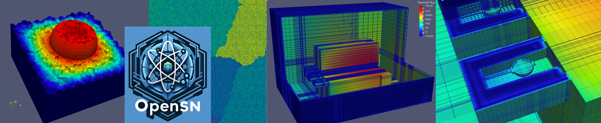

  

  

# openSn #

openSn is a large-scale scientific simulation engine being developed at 
Texas A&M University as part of a research study on massively parallel 
algorithms for modeling and simulation. Currently, the main physics modules 
of openSn deal with solving the linear Boltzmann equation and 
diffusion-reaction physics.

Please visit the links below where you will find:

- [Compilation and run instructions](doc/start_install.md)
- [Source code documentation](doc/start_source_code_doc.md)
- [User Tutorials](doc/start_user_tutorials.md)
- [Developer Tutorials](doc/start_developer_tutorials.md)
- [Simulation Gallery](doc/gallery.md)

For help, please post on our [Discussions](https://github.com/Open-Sn/openSn/discussions) page.
