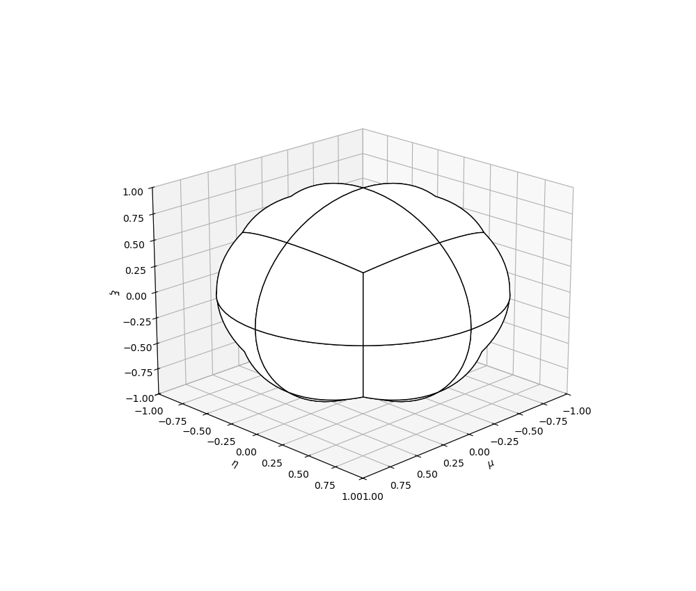
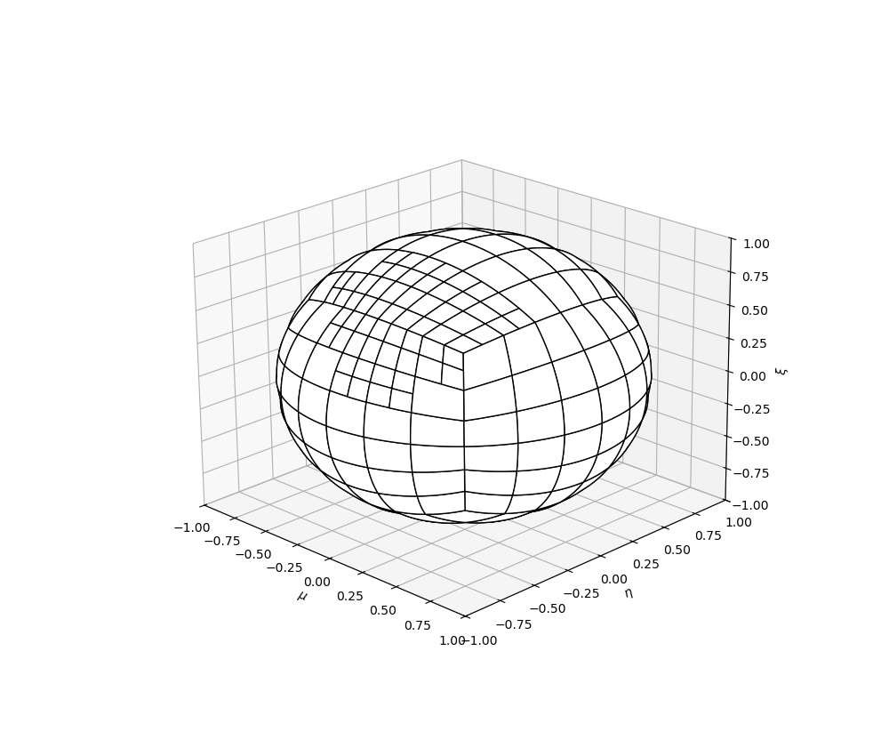

# Plotting Angular Quadrature Discretization

## SLDFE Plotter

When running a problem that manipulates angular quadratures. Assuming the file base is <basename> the following 3 files will be created:
<basename>_verts.csv
<basename>_cells.csv
<basename>_points.csv

1. Move all three of these files into this folder
2. In [sldfe_plot_quadrature.py](sldfe_plot_quadrature.py) edit line 8 to be the file base indicated above
3. Execute the python script

An example of an SLDFE uniform discretization

An example of an SLDFE with local refinement

[Return to tools](../../README.md)