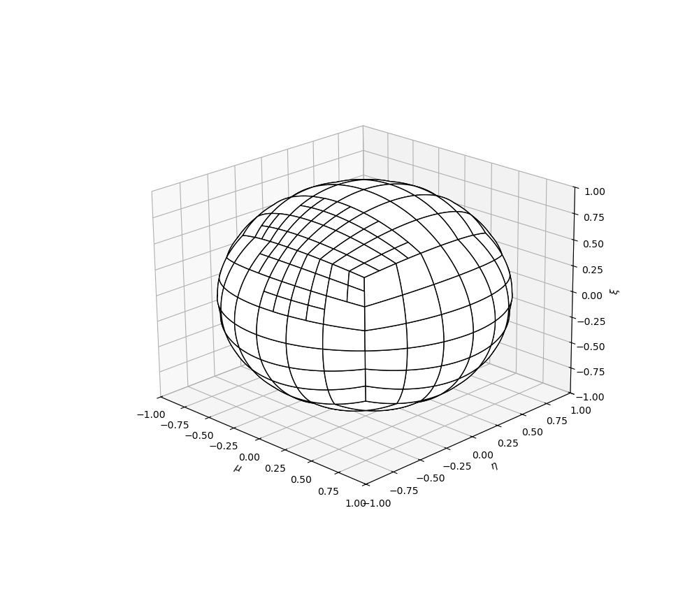

# Plotting Angular Quadrature Discretization

## SLDFE Plotter

When printing a sLDFE quadrature, three files will be generated:
- `<basename>`_verts.csv
- `<basename>`_cells.csv
- `<basename>`_points.csv

Pass the path of those files and their basename to [plot_sldfe_quadrature.py](sldfe_plot_sldfe_quadrature.py).

An example of an SLDFE uniform discretization

An example of an SLDFE with local refinement

[Return to tools](../../README.md)